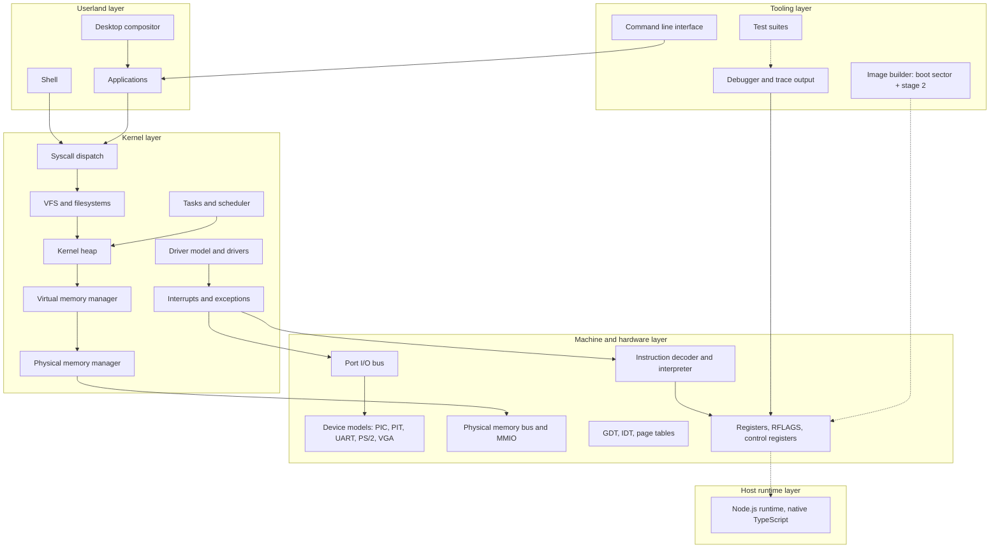
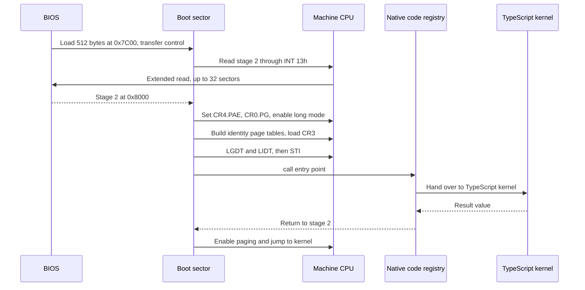

# VerixOS architecture

This document describes how VerixOS is put together and, more importantly, why.
It is written for someone reading the source for the first time who wants to know
which decisions were deliberate.

Contents: [design goals](#design-goals) ·
[non-goals](#non-goals) ·
[layers](#layering) ·
[memory map](#memory-map) ·
[the native code boundary](#the-native-code-boundary) ·
[memory management](#memory-management) ·
[the interrupt model](#the-interrupt-model) ·
[the scheduling model](#the-scheduling-model) ·
[the VFS](#the-vfs) ·
[the syscall ABI](#the-syscall-abi) ·
[the driver model](#the-driver-model) ·
[userland](#userland) ·
[boot sequence](#boot-sequence) ·
[extension points](#extension-points) ·
[trade-offs](#design-trade-offs)

## Design goals

1. **Be genuinely architectural, not approximate.** If the machine model claims
   to implement paging, it implements the real four-level walk with the real
   permission checks and the real page-fault error code. If it claims a GDT, it
   encodes descriptors the way the hardware encodes them. A subsystem that
   shortcuts these rules produces a kernel that cannot be reasoned about against
   the Intel SDM, which defeats the point.
2. **Make every number traceable.** Architectural constants live in one place
   and carry SDM citations. Where the manual specifies a value, the value in the
   tree matches the manual.
3. **Fail loudly.** An access to an unmapped physical address, an unclaimed I/O
   port, an overlapping port registration or an unknown opcode raises. Nothing
   silently reads zero. Bugs that hide behind permissiveness during bring-up
   surface as impossible states later.
4. **Keep the build trivial.** Zero runtime dependencies, no build step required
   to run, no external toolchain. Node's native TypeScript support does the work.
5. **Keep one honest boundary.** The point where machine code meets TypeScript is
   a single, named, documented interface — not a scattering of special cases.
6. **Keep the subsystems portable of design.** The subsystem decomposition should
   survive a change of implementation language. A native backend should be a
   swap of code behind the boundary, not a rewrite of the architecture.

## Non-goals

Stating these plainly saves a lot of argument:

- **VerixOS does not run on bare metal today.** The kernel executes inside the
  machine model. There is no path from a reset vector to silicon.
- **It is not QEMU-compatible.** VerixOS runs its own machine model; it does not
  emulate a specific PC configuration for QEMU.
- **It is not performance-oriented.** The interpreter models semantics, not
  timing. There are no cycles, no cache, no speculation.
- **It is not multi-user or security-hardened.** There is no authentication, no
  mandatory access control, and no privilege boundary that has been audited.
  Ring 3 exists, but it is not a security boundary here.
- **It does not aim to support every x86-64 instruction.** It implements the
  subset the milestones need, and raises `#UD` for the rest. Completeness is not
  the goal; honesty about the subset is.
- **It is not a hobby-toy "OS" in the sense of a demo.** The subsystems are
  structured as they would be in a real kernel, with real interfaces between
  them, because the alternative teaches the wrong thing.

## Layering

Five layers. Each depends only on the layers beneath it.

Solid arrows mean "uses or depends on". Dotted arrows mean "is implemented
by" or "produces".

The dependency direction is the important part. The kernel layer knows that it
is running on a machine with ports and memory; it does not know that the machine
is implemented in TypeScript. That is what allows the native backend described in
the roadmap to exist without changing any kernel interface.

## Memory map

Physical addresses. The low megabyte follows the IBM PC AT layout; the MMIO
apertures are the standard PC ones.

| Range | Size | Contents |
| --- | --- | --- |
| `0x0000_0000`–`0x0000_03FF` | 4 KiB | Real-mode interrupt vector table; IVT entries are segment:offset pairs, four bytes each |
| `0x0000_0400`–`0x0000_04FF` | 256 B | BIOS data area, read by the boot sector and handed to stage 2 |
| `0x0000_0500`–`0x0000_6FFF` | ~27 KiB | Conventional memory available to the boot path |
| `0x0000_7C00`–`0x0000_7DFF` | 512 B | Boot sector, loaded by the BIOS at `BOOT_SECTOR_LOAD_ADDRESS` |
| `0x0000_8000`–`0x0000_BFFF` | 16 KiB | Stage 2, up to `STAGE2_MAX_SECTORS` (32) sectors of 512 B |
| `0x0000_C000`–`0x0006_FFFF` | ~440 KiB | Conventional memory |
| `0x0007_0000`–`0x0007_FFFF` | 64 KiB | Boot page tables: PML4, PDPT, PD and PT, four contiguous 4 KiB tables |
| `0x0008_0000`–`0x0008_0FFF` | 4 KiB | Boot GDT (`BOOT_GDT_ADDRESS`); entries are 8 bytes |
| `0x0008_1000`–`0x0008_1FFF` | 4 KiB | Boot IDT (`BOOT_IDT_ADDRESS`); 256 gates of 16 bytes |
| `0x0009_0000`–`0x0009_FFFF` | 64 KiB | Conventional memory below the EBDA |
| `0x000A_0000`–`0x000B_FFFF` | 128 KiB | VGA window; the text-mode console buffer is at `0x000B_8000` |
| `0x000C_0000`–`0x000F_FFFF` | 256 KiB | ROM area, including the EBDA at `0x000F_0000`–`0x000F_FFFF` |
| `0x0010_0000`–`0x6FFF_FFFF` | ~110 MiB | Extended RAM; the domain the frame allocator works in |
| `0x4000_0000` | — | Upper extent of the identity mapping established by stage 2 (`BOOT_IDENTITY_MAP_BYTES`, 1 GiB) |
| Kernel heap | dynamic | Kernel arena, allocated by the PMM above the regions above; the base is chosen at boot and reported in the memory summary |
| Framebuffer | mode-dependent | VGA linear framebuffer aperture used in graphics mode; reserved by the VGA model |
| `0xE000_0000`–`0xEFFF_FFFF` | 256 MiB | PCI configuration space via MMCONFIG |
| `0xFEC0_0000`–`0xFECF_FFFF` | 1 MiB | IOAPIC registers |
| `0xFEE0_0000`–`0xFEE0_FFFF` | 64 KiB | Local APIC registers |

Notes on the entries that are not self-explanatory:

- The boot page tables, GDT and IDT addresses are fixed by agreement between
  stage 2 and the kernel. They are declared in one place precisely so that the
  assembly and the TypeScript cannot drift apart.
- The identity map covers 1 GiB so that the kernel can run at its physical
  addresses before it has a virtual address for itself. See
  [higher half](#identity-mapping-before-the-higher-half).
- The LAPIC and IOAPIC apertures are mapped but are not yet on the interrupt
  path. See [limitations](README.md#limitations-and-current-limitations).
- The framebuffer aperture is reserved by the VGA device model and its exact
  base depends on the mode the model is configured for; it is not yet pinned
  down. Treat the row as provisional.
- Physical addresses are modelled as 40 bits wide (`PHYSICAL_ADDRESS_BITS`).
  Virtual addresses use the standard four-level, 36-bit decomposition with four
  9-bit indices at shifts 39, 30, 21 and 12.

## The native code boundary

### Why it exists

A kernel that runs only in a simulator can drift from the architecture, because
nothing forces it to obey it. Real x86-64 boot sequences must execute real
instructions at real addresses, through a real GDT, in a real mode transition.

So VerixOS does not write the whole kernel in machine code. It draws one line,
names it, and puts machine code on the correct side of it.

### What it is

The **native code registry** is the single interface between machine code and the
TypeScript kernel. It is a table mapping entry identifiers to x86-64 code
blocks, assembled by the project's own TypeScript assembler. A `call` from the
boot path resolves to a registry slot; the slot's implementation performs the
handover into the TypeScript kernel and returns the result to the caller.

The sequence below is a boot-sector `call` reaching kernel code.

### What it does not mean

Two statements that are easy to misread:

1. **The TypeScript kernel is executed by the machine model's runtime.** It is
   not compiled to machine code and it does not run on silicon. Only the
   registry entries are machine code.
2. **A native backend changes the implementation, not the design.** A future
   Rust or Zig backend replaces the code behind the boundary. The memory map,
   the syscall ABI, the driver model, the VFS interface and every subsystem
   contract above it stay as they are.

The registry exists so that the boundary is a place you can point at, in a
debugger, in a trace and in a review, rather than a property of the system you
have to take on trust.

## Memory management

### Physical memory manager

The PMM hands out 4 KiB frames from a **bitmap**. Bit *n* of the bitmap is set
when frame *n* is in use, clear when it is free. The bitmap itself is a
kernel-heap allocation covering the whole of installed RAM, which works because
a bitmap is a fixed, knowable fraction of the address space it describes: one bit
per frame, so one thirty-second of RAM, and the size is known before any frame
is handed out.

Allocation is a scan for the first clear bit with a rotating hint so that
successive allocations do not repeatedly rescan the low end. Free clears the
bit and checks for double-free.

**Why a bitmap and not a free list.** A free list is better when allocations and
frees are frequent and locality matters, because a free list gives back the frame
that was most recently released, which is usually warm. VerixOS allocates
frames at a rate dominated by page faults and faults a page, and its physical
memory is a flat array, so the locality argument does not buy much. The bitmap
is simpler to reason about, which matters more here: "is this frame allocated"
is a bit test, and a free list does not answer it without either a marker or a
search. Debugging and whole-system inspection are also trivial against a bitmap,
and reconstructing the state of the machine is a matter of dumping the bitmap.
The rotating hint recovers most of the locality loss at a fraction of the
complexity.

The PMM also owns the reserved set: the boot page tables, the boot GDT and IDT,
the boot sector and stage 2, the VGA window and whatever MMIO apertures are
claimed are never handed out. **Free is a claim about frames, not about bytes** —
four contiguous frames are four separate claims, and a large physical contiguous
allocation is assembled from them rather than being a distinct operation.

### Virtual memory manager

The VMM implements the x86-64 four-level walk. A virtual address decomposes into
four 9-bit indices (bits 39, 30, 21, 12) plus a 12-bit page offset. Each level
holds 512 eight-byte entries; the leaf entry carries the physical frame number in
bits 12–51, the present bit, the read/write, user/supervisor, accessed, dirty,
page-size and NX bits. `PML4 → PDPT → PD → PT → frame` is `4 × 512 × 4 KiB` of
reach for 48-bit virtual addresses.

#### Identity mapping before the higher half

Stage 2 builds identity mappings and
runs the kernel at its physical addresses. Only once the kernel is up, with a heap
it can allocate page tables from, does it map itself into the higher half. The
alternative — higher half from the first instruction — is the textbook approach
and it is not worth the cost here. Bootstrapping higher-half paging requires
temporary mappings and a stack switch under conditions where a mistake is very
hard to diagnose. Identity mapping first means the boot path has no window in
which a mapping bug loses the kernel entirely. Higher-half mapping is then an
ordinary, testable operation performed by a kernel that already works.

**TLB and invalidation policy.** The model is architecturally faithful about the
walk, so it is faithful about the consequences: after modifying a PTE the stale
translation must not survive. The CPU models a small direct-mapped TLB, and the
VMM issues architecturally correct invalidations rather than flushing everything
as a shortcut. A narrow invalidation is the operation real kernels need, and
writing the code that way means the same sequence is correct when it eventually
runs where a full flush costs something.

Permission handling is real: a user-mode access to a supervisor page, a write to
a read-only page, an instruction fetch from a page without the NX bit inverted,
or an access with `CR0.WP` set behaves as the SDM specifies, and each raises the
right exception with the right error-code bits.

### Kernel heap

The kernel heap is a size-segregated free-list allocator over frames obtained
from the PMM, with block headers carrying size and a used flag, adjacent free
blocks coalescing on release, and split when a request cannot be satisfied by a
whole block.

**Why free lists and not a slab here.** The PMM and the VMM allocate whole frames,
so the bitmap suits them. The heap serves the rest of the kernel, whose requests
are small, varied and frequent. A bitmap is the wrong shape for that: it would
either round everything up to a frame or need a second allocator to track
sub-frame occupancy. Coalescing matters more than anything else for fragmentation
in a kernel that repeatedly allocates and frees variable-size structures, so it
is worth the bookkeeping. Where allocation counts justify it later, per-subsystem
arenas sit naturally on top without changing the interface.

## The interrupt model

### From the IVT to the IDT

In real mode the CPU fetches interrupts through the interrupt vector table at
physical address zero: 256 four-byte entries, each a segment:offset pair. It is
a flat array with no protection, no type information and no privilege checks.

The IDT is its protected-mode replacement and points at a table of 16-byte
gates, each carrying a type, a privilege level, and a full offset — 16 bytes
because the offset is a full 64-bit quantity. The migration is a single
instruction: `LIDT` loads the base and limit of the new table, and from that
moment interrupt delivery goes through the IDT instead of the IVT. The IVT is
still there in low memory and is still what the boot sector relies on, but the
kernel does not use it.

### Gate types

The type field in the gate's low byte distinguishes four shapes:

| Type | Value | Behaviour |
| --- | --- | --- |
| Task gate | `0x5` | Transfers control through a TSS descriptor |
| 16-bit interrupt gate | `0x6` | Clears IF on entry |
| 16-bit trap gate | `0x7` | Leaves IF set on entry |
| 32-bit interrupt gate / 64-bit interrupt gate | `0xE` | Clears IF on entry |
| 32-bit trap gate / 64-bit trap gate | `0xF` | Leaves IF set on entry |

VerixOS installs 64-bit interrupt gates (`0xE`) for hardware interrupts and 64-bit
trap gates (`0xF`) where the handler must run with interrupts still enabled —
notably the page-fault handler, which must be able to take a timer interrupt and
still make progress.

### Page faults, end to end

1. An instruction references a linear address. The MMU walks `CR3` and finds
   either a non-present entry or a permission violation.
2. The CPU raises `#PF`. It pushes `SS`, `RSP`, `RFLAGS`, `CS`, `RIP` and a
   two-byte error code, loads `CR2` with the faulting linear address, and — if
   the fault happened at ring 3 — loads `CS`, `SS` and `RSP` from the TSS for the
   ring change. The new stack is kernel-owned, so the fault frame lands in
   kernel memory.
3. The error code carries the reason: bit 0 present, bit 1 write, bit 2
   user/supervisor, bit 3 reserved, bit 4 instruction/data. On an unbacked bus
   access the memory bus raises, and the CPU converts that into a present-page
   fault with bit 0 set, because an unmapped address is by definition absent
   from RAM.
4. The fault stub dispatches to the VMM with the address from `CR2` and the access
   kind from the error code.
5. The VMM looks up the mapping. For a copy-on-write page it duplicates the
   frame and clears the write permission on the original; for a page that is
   absent but should exist it allocates a frame, zeroes it, and installs a PTE
   with protection matching the mapping, including NX for a data page and US for
   a user page.
6. The VMM invalidates the affected TLB entry and returns.
7. Execution resumes at the faulting instruction. Because the fault was a
   not-present fault, the retry now succeeds.

If no mapping can be created, the outcome depends on who faulted. At ring 3 the
process is terminated, because a bad access by user code is that process's
problem. In kernel mode it is a panic, because it means the kernel has a bug and
continuing would corrupt more state. Kernel stacks are mapped eagerly and are
never demand-paged, so a fault can never need a stack it does not have.

### The PIC, and why `0x20` and `0x28`

The legacy 8259A pair delivers interrupt requests to the CPU as vector numbers
offset by a programmable base. After reset the master is based at `0x08` and the
slave at `0x70`, which lands directly on `0x08` (double fault), `0x0E` (page
fault) and, for the slave, `0x70` (a real-mode BIOS int 0x10) — `0x08` is the
unfortunate case of the master at `0x10`. VerixOS remaps them to `0x20` and
`0x28`, so IRQ 0 becomes vector `0x20` through to IRQ 7 at `0x27`, and IRQ 8
through IRQ 15 become `0x28` through `0x2F`.

The reasons:

- **Exceptions keep the low vectors.** Architecturally defined exceptions occupy
  `0x00` through `0x21`, and a device must never be able to occupy one. Placing
  hardware IRQs above the exception range removes the class of bug where a device
  masks an exception handler.
- **The BIOS handler addresses are avoided.** The `0x70` base puts the slave
  PIC on `0x70`–`0x77`, colliding with the real-mode BIOS interrupt vector for
  `INT 10h` and friends. The kernel must not be disturbed by BIOS handlers.
- **`0x20` and `0x28` are conventionally free.** The band above the exception
  range and below `0x30` is unclaimed on a PC, and using the conventional values
  means traces and documentation read like every other x86-64 kernel's.

Remapping is the ICW1 sequence (ICW4 enabled, single PIC), ICW2 for the vector
base, and an ICW3 declaring the slave on IRQ 2. The cascade on IRQ 2 is why
`IRQ.CASCADE` exists in the IRQ constants: it is not a device, it is the wire
between the two controllers, and it must not be claimed by a driver.

Remapping is idempotent in effect: repeating it writes the same bases. The
masks are set to all-masked before the sequence so no device interrupts a
half-initialised controller, and are unmasked one line at a time as drivers bind.

## The scheduling model

### Cooperative versus preemptive

Preemptive, on the timer tick. The reasons:

- A cooperative scheduler means any thread that loops without yielding wedges the
  machine. In userland that is a hang with no diagnostic, and it is exactly the
  kind of failure that is hard to debug and easy to design out.
- Preemption is what makes the interrupt and scheduling paths interact, which is
  the interesting part. A cooperative design leaves the interaction untested
  until SMP arrives, which is the worst time to discover it.
- Yielding on demand remains available as a syscall for code that wants to give
  up the rest of its slice voluntarily.

### The switch

Threads are switched at a well-defined point — a syscall return or a return from
an interrupt — not in the middle of an instruction. The switch is:

1. Push the current thread's callee-saved registers, `RSP` and return `RIP`
   into its control block.
2. Take the next runnable thread from the ready queue.
3. Load its callee-saved registers and `RSP`, and set `CR3` to its address space.
4. Return with `iretq`, which restores `RIP`, `CS`, `RFLAGS`, `RSP` and `SS`
   together.

Using `iretq` rather than a software return is deliberate: the hardware syscall
entry already gives us the return address in `RCX` and the saved `RFLAGS` in
`R11`, which are precisely the pieces a return needs, and ring transitions take
their stack from the TSS. The same instruction therefore serves a syscall return,
a context switch and an interrupt return.

### The ready queue

The ready queue is a FIFO of runnable threads, one per priority level. The
scheduler picks the highest non-empty level and takes from its head, which gives
round-robin behaviour within a level and strict priority between levels, with no
priority inversion in the common case because a thread does not run while a
higher-priority thread is runnable. A thread that blocks — on a syscall, a wait
queue or a fault — leaves the ready queue entirely; there is no preemptive
priority boost and no ageing. Preemption happens when the PIT tick finds the
current thread preemptible.

### A page fault in kernel mode

A fault taken in kernel mode is not a scheduling event. The faulting thread's
kernel stack is already mapped, so the handler runs on it directly and restores
the thread to it on return; no switch is needed and the ready queue is untouched.
If the fault can be satisfied, the thread resumes exactly where it was. If it
cannot, the kernel panics — a kernel-mode fault that cannot be resolved is a bug
in the kernel, and terminating the current thread would hide it.

The rule that falls out of this: nothing in the kernel may take a demand-paged
fault on its own stack or on data it did not map. Kernel memory is mapped
eagerly, precisely so that the fault path has a stack to run on.

## The VFS

### The node abstraction

Everything the VFS exposes is a **node**: an inode-like object with a mode, a
size, a parent link, an operations table, and a backend-private payload. The
operations table, not the concrete type, is the interface. Callers never learn
whether a node came from the initrd, the ramdisk or a block device; they call
through the table.

### The operations table

| Operation | Purpose |
| --- | --- |
| `lookup(parent, name)` | Resolve one path component to a child node |
| `readdir(node)` | Enumerate a directory's children |
| `open(node, flags)` | Acquire a handle, checking the requested access |
| `close(handle)` | Release a handle |
| `read(handle, buf, len, offset)` | Read at a byte offset |
| `write(handle, buf, len, offset)` | Write at a byte offset |
| `seek(handle, offset, whence)` | Move the handle's offset |
| `stat(node)` | Return mode and size |
| `truncate(node, size)` | Set the length of a regular file |

Operations return negative errno-style values rather than throwing, which is what
lets a single return convention carry the result all the way to a syscall.

### Layering

Three backends, in the order they are brought up:

1. **Initrd** — a read-only archive built into the image. It provides the kernel
   image itself and the minimum of files needed to start. It exists because the
   first thing a filesystem needs is a place to come from.
2. **Ramdisk** — a mutable in-memory filesystem layered over the initrd. This is
   where writes, creates and unlinks land. It is a real filesystem with a real
   operations table, not a special case in the VFS.
3. **Block device** — not yet. It is the reason the operations table is shaped
   the way it is: a filesystem needs a block-level interface with reads, writes
   and a flush, and the node abstraction does not leak that.

Read-only and writable are distinguished per node, so a stack of read-only
mounts over a writable one behaves as users expect rather than as a special case.

### Path resolution

A path is resolved from a mount table, one component at a time:

- Split on `/`; an empty path resolves to root.
- `.` is discarded and `..` moves to the parent, bounded by the root of the mount.
- Each remaining component is a `lookup` on the node reached so far.
- A `..` that would escape a mount root stops at that root rather than escaping
  into the parent filesystem.

There are no symbolic links initially. When they arrive they resolve to a node
and a remaining path, and the resolution loop simply continues with that node —
which is why the loop is written as a loop and not as a recursion over
components.

## The syscall ABI

### Convention

`rax` carries the number, `rdi`, `rsi`, `rdx`, `r10`, `r8`, `r9` carry
arguments one through six. `rcx` holds the return address and `r11` holds the
saved `RFLAGS`; both are set by the hardware on entry. The return value comes
back in `rax`.

| Register | Role |
| --- | --- |
| `rax` | Syscall number in, return value out |
| `rdi` | Argument 1 |
| `rsi` | Argument 2 |
| `rdx` | Argument 3 |
| `r10` | Argument 4 |
| `r8` | Argument 5 |
| `r9` | Argument 6 |
| `rcx` | Return address, clobbered by the syscall entry |
| `r11` | Saved `RFLAGS`, clobbered by the syscall entry |
| `rsp` | Points at the user-visible stack; the kernel switches to the TSS stack |
| `rip` | Points at the instruction after the syscall when a fault occurs |

`rcx` and `r11` are the two registers the syscall instruction destroys. Using
them as the return address and the saved flags means the transition costs no
extra memory traffic, and returning with `sysretq` consumes exactly those two.
Note that `r10` rather than `rcx` holds argument 4, precisely because `rcx` is
gone.

**Why System V.** It is the convention the rest of the userland uses, so the same
compiled code makes ordinary calls and system calls. It is the convention the
hardware entry already fits. And it is the convention people already know, which
removes a whole category of documentation that would otherwise have to be
written and maintained.

Errors are negative return values, and `rax` is the only channel. A non-negative
result is a value of the requested type; a negative result is `-errno`. There is
no separate error register and no `errno` in the caller, which keeps the
interface to one register.

### Numbers

| Number | Name | Arguments | Result |
| --- | --- | --- | --- |
| 0 | `exit` | `status` | Does not return |
| 1 | `yield` | — | `0` |
| 2 | `get_tid` | — | Thread id |
| 3 | `get_pid` | — | Process id |
| 4 | `write` | `fd`, `buf`, `len` | Bytes written, or negative errno |
| 5 | `read` | `fd`, `buf`, `len` | Bytes read, 0 at end of file, or negative errno |
| 6 | `open` | `path`, `flags` | Handle, or negative errno |
| 7 | `close` | `handle` | `0`, or negative errno |
| 8 | `seek` | `handle`, `offset`, `whence` | New offset, or negative errno |
| 9 | `getc` | — | Byte, or negative errno |
| 10 | `putc` | `byte` | `0`, or negative errno |
| 11 | `get_flags` | — | Snapshot of the caller's `RFLAGS` |
| 12 | `mm_probe` | `addr`, `len` | `0` if the range is mapped and accessible, else negative errno |
| 13 | `nop` | — | `0` |

Numbers 0 through 9 are frozen: once userland depends on them they cannot change.
`mm_probe` exists so the test suite can ask the VMM whether a range is mapped
without attempting an access.

The full contract, including what userland may rely on, is in
[docs/abi.md](docs/abi.md).

## The driver model

A driver is a descriptor with a name, a probe function and a bind function,
registered from a table the kernel walks during initialisation.

**Probe** asks whether the driver recognises the hardware on a given bus. It
inspects registers and answers yes or no, and it has no side effects — so a
probe for an absent device is harmless and order-independent.

**Bind** claims the resources the driver needs and installs its interrupt
handler. It returns an unbind closure, mirroring the bus registration APIs,
which is what makes hot-unplug plausible later even though nothing calls it yet.

The two resource-claiming APIs are the strict ones already in the machine layer:

- **Ports**: `PortIoBus.register(device)` claims a contiguous range. Every port
  in the range is recorded, so an overlapping claim is a hard error at bind time
  rather than a device that mysteriously shadows another one. The returned
  closure releases the range.
- **MMIO**: `MemoryBus.mapRegion(region)` claims a physical range. Regions are
  held sorted and looked up by binary search, so claiming and looking up stay
  cheap as devices accumulate. `unmapRegion(name)` releases one.

**Interrupt wiring** is a separate step from binding, so a driver that only
touches memory need not claim an IRQ. A driver claims a vector from the PIC and
installs a handler; the vector is owned by the driver, and the mask is cleared
when the handler is installed and set again when the driver unloads.

Access width is part of both APIs. A byte write to a 32-bit-only device register
is caught rather than silently truncated, and a port access that would cross the
end of a device's range is an error rather than a wrap.

## Userland

### The shell

The shell reads a line, splits it into a command and arguments, and dispatches
against a command table of name to handler. Each handler receives the argument
vector and returns a status that becomes the next prompt's exit code.

The command set covers what a userland can actually do with the ABI available:
`help`, `mem` for a memory summary, `ps` for the task list, `dev` for bound
drivers, `ls`, `cd`, `cat`, `echo` and `clear`, plus `run` to start an
application. Commands that touch files go through syscalls only — the shell has
no privileged access, which is what keeps the userland boundary honest while it
is being built.

Dispatch is a table, not a switch, so adding a command is adding a table entry,
and an unknown name produces `unknown command` rather than a fall-through.

### The desktop compositor

The compositor owns a back buffer the size of the screen and presents it by
copying to the framebuffer.

- **Double buffering** means the compositor never draws into the buffer being
  presented. A partially drawn frame is never visible. It also means the
  expensive copy is the only thing touching the framebuffer, so presentation
  cost is predictable and independent of how much was drawn.
- **Damage rectangles** mean only the regions that changed are recomposed. A
  clock ticking does not cost a full redraw; a window moving costs the union of
  its old and new rectangles. Compositing checks each window's damage against
  the clipped visible region, so an occluded window does no work at all.
- **Input focus** is a single owner, tracked as part of compositor state. Events
  go to the focused window; clicks that land outside any window change focus and
  are otherwise consumed by the compositor. Focus follows the topmost window
  unless the user has pinned a window, which keeps a backgrounded window from
  stealing keystrokes while the user is typing into another one.

### The application model

An application is a set of windows with a message loop: input events and
exposure events arrive, the application updates its state, and it marks damage.
The compositor owns layout and presentation; the application owns content. The
app model is deliberately thin, because the interesting work at this stage is in
the kernel, and a rich widget toolkit is not what proves the subsystem split
works.

## Boot sequence

From reset to the first prompt.

1. **Reset.** The machine model initialises registers to the architectural reset
   state, loads the BIOS at the reset vector, and enters real mode at `CS:IP` of
   `0xF000:0xFFF0`. The machine is a single CPU with interrupts masked, `CR0.PG`
   clear.
2. **BIOS.** The model runs a small BIOS that reads the boot drive with `INT 13h`,
   loads 512 bytes to physical `0x7C00`, and transfers control to it. The BIOS
   data area at `0x400` is populated first, because the boot sector needs it.
3. **Boot sector.** 512 bytes at `0x7C00` run in real mode with `CS:IP` set to
   `0:0x7C00`. The sector is position-dependent code: it must copy itself, or
   read forward, because it does not fit. It reads the BIOS data area, uses the
   `INT 13h` extended read to load stage 2 to `0x8000`, and jumps there. It sets
   up a minimal stack and enables A20 before it can rely on the CPU seeing more
   than 64 KiB.
4. **Stage 2 entry.** Stage 2 is a 64-bit program at `0x8000`. It is entered
   still in real mode, having loaded a short jump into a 64-bit code path; the
   far jump loads the GDT it is about to build and enables long mode.
5. **Long mode.** Stage 2 sets `CR4.PAE`, prepares a page table with the physical
   bit set, sets `CR0.PG`, loads `CR3`, and executes `LGDT` followed by a far jump
   into 64-bit code. This is the point at which the interpreter switches from
   legacy decoding to long mode.
6. **Identity page tables.** Stage 2 builds four contiguous 4 KiB tables at
   `0x70000` — PML4, PDPT, PD, PT — and maps the first 1 GiB identity so that
   every physical address it currently uses, including its own code, stays
   reachable. The tables are made present before paging is enabled, because the
   instructions after that point require translations.
7. **Descriptors.** `LGDT` loads the GDT at `0x80000` with a 64-bit code segment,
   a data segment and a null descriptor. The long jump reloads `CS`; `DS`, `ES`,
   `SS` are reloaded to the data selector.
8. **IDT.** `LIDT` loads the IDT at `0x81000`. It is populated with the exception
   gates the kernel needs — divide error, invalid opcode, general protection,
   page fault, double fault — and the hardware vectors once the PIC is remapped.
   Populating the IDT before enabling interrupts is not optional: an interrupt
   taken with an unpopulated IDT has nowhere to go.
9. **Interrupts.** The PIC is remapped to `0x20` and `0x28`, masks are left off,
   and `STI` enables interrupts. At this instant stage 2 is a working long-mode
   system with an exception path.
10. **Kernel entry.** Stage 2 calls through the native code registry into the
    TypeScript kernel: `kmain` receives a memory report, the BDA-derived
    information, and the address of the identity-mapped physical memory.
11. **Kernel start.** `kmain` initialises in dependency order: PMM, taking over
    the memory the firmware left; heap; VMM, promoting the kernel to the higher
    half; GDT and IDT with the full gate set; exception handlers; PIC remapping;
    the driver model; then device drivers, each probing and binding in turn.
12. **Root filesystem.** The initrd is mounted and the ramdisk is layered over it,
    giving a writable root.
13. **Userland.** The kernel creates the first process and loads the shell. The
    scheduler starts, the PIT is programmed for the tick, and the shell starts
    reading input from the keyboard driver and the console from the UART and VGA
    text drivers.
14. **First prompt.** The shell renders its prompt, the vertical slice is
    running. From here the milestone adds the scheduler, the filesystem, the
    desktop and its applications.

## Extension points

### Adding a driver

1. Implement the bus interface: `PortDevice` for a port-range device, or
   `MmioRegion` for a memory-mapped one. `RegisterDevice` in the machine layer
   covers the common fixed-register-file case.
2. Write `probe(bus)`: read the device's identification registers and return
   whether it is present. No side effects.
3. Write `bind(bus)`: claim ports or map MMIO, install the interrupt handler,
   and return an unbind closure.
4. Add the descriptor to the registration table the kernel walks at
   initialisation.
5. Add a test that constructs the device, runs `probe`, asserts the expected
   answer, and — if it binds — exercises the claim.

Because the buses reject overlapping claims and out-of-range accesses, a driver
that claims the wrong resources fails loudly at bind time instead of corrupting
another device later.

### Adding a syscall

1. Add the number to the `Syscall` table and the name to `SYSCALL_NAMES`.
   Allocate from the unfrozen range; do not renumber 0 through 9.
2. Add the case to the dispatcher, decode the arguments, and return either a
   value or a negative errno.
3. Decide what userland is allowed to assume about it, and write it down in
   [docs/abi.md](docs/abi.md). An undocumented syscall is an ABI change with no
   changelog entry.
4. Add a test that calls it and checks both the success result and the error
   result, including the error path for a bad argument.

## Design trade-offs

| Decision | Alternatives | Why this one |
| --- | --- | --- |
| Bitmap frame allocator | Free lists, buddy, zone allocator | One bit per frame answers "is this allocated" directly, is trivially dumpable, and needs no per-frame metadata. A free list is better under heavy churn with locality needs; VerixOS allocates mostly at fault time from flat memory, and debuggability is worth more here |
| Identity map first, higher half after | Higher half from the first instruction | Bootstrapping higher-half paging needs temporary mappings and a stack switch in the least forgiving possible conditions. Identity mapping first removes that window entirely, at the cost of a later, ordinary mapping step |
| Narrow TLB invalidation | Full flush on every mapping change | Full flushes are simpler and the model does not measure cycles. Using the architecturally correct invalidation means the same code stays correct where flushing is expensive, and it keeps the model honest |
| Size-segregated free lists for the kernel heap | Slab allocation, bitmap, bump allocator | The heap serves small, varied, frequent requests where a bitmap would round everything up to a frame. Coalescing addresses fragmentation. Slabs sit on top later without changing the interface |
| TypeScript kernel now | Writing the kernel in C, Rust or Zig today | The immediate constraint is iteration speed on a subsystem design that is still moving, and the machine model already constrains the architectural behaviour. A native backend is a bounded, well-defined swap behind the registry |
| One documented native code boundary | TypeScript only, or machine code throughout | Machine code only would be slow to develop and hard to review. A single named boundary keeps real instructions where they are needed for fidelity while leaving one place to point at |
| Legacy 8259A PIC and 8254 PIT | Local APIC and IOAPIC | The legacy path is small, fully documented and sufficient for uniprocessor interrupt work. APIC is required for SMP and for modern interrupt routing; it is a later phase, not a prerequisite for a working kernel |
| Preemptive round-robin | Cooperative scheduling | A preemptive kernel cannot be wedged by a thread that forgets to yield, and it exercises the interaction between interrupts and scheduling, which is where the real design risk is |
| Priority levels with FIFO within a level | Single run queue, full priority queue | Strict priority between levels with round-robin inside a level is predictable and easy to state. Ageing and priority boosts can come later without changing the interface |
| System V syscall convention | Windows C convention, a new one | It matches the userland ABI, it is what the hardware entry already fits, and it needs no separate documentation for something people already know |
| Negative return values for errors | Exceptions, a separate error register | One return channel, no unwinding across the userland boundary, and a value that survives being copied into a register |
| Node abstraction with an operations table | Concrete classes, one big filesystem | Callers depend on the table, so a filesystem can be added without touching the VFS or its callers. This is what makes the later block-device filesystem affordable |
| Initrd then ramdisk | One writable filesystem from the start | The first filesystem needs somewhere to come from. A read-only initrd answers that without a chicken-and-egg problem, and the ramdisk that sits on top is a real backend, not a special case |
| Absolute path resolution in a loop | Recursive descent, per-filesystem path handling | A loop handles `..` and future symbolic links uniformly. Recursion over components is shorter and does not compose with links |
| Command table for the shell | `switch` statement | Adding a command is adding an entry, and an unknown name has one obvious failure instead of a fall-through |
| Double buffering with damage rectangles | Direct drawing to the framebuffer | No partial frame is ever visible, and redraw cost tracks what changed. The cost is a copy per present, which the model does not penalise |
| `as const` objects instead of `enum` | TypeScript `enum` | The project relies on Node's erasable-syntax type stripping, and `enum` is not erasable. The `as const` object plus a `typeof`-derived type gives the same inference and stays erasable |
