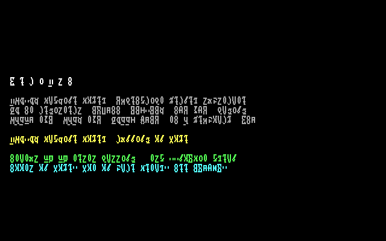
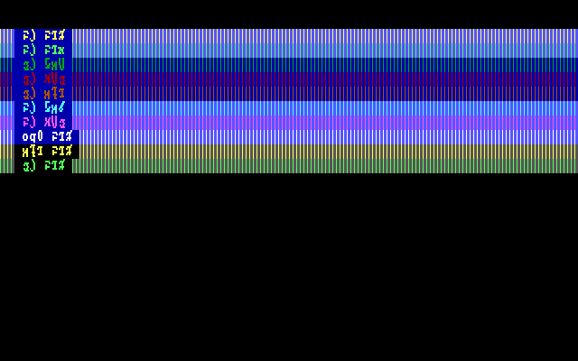
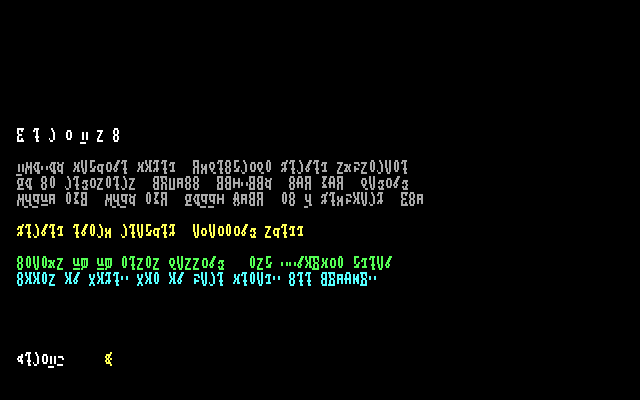
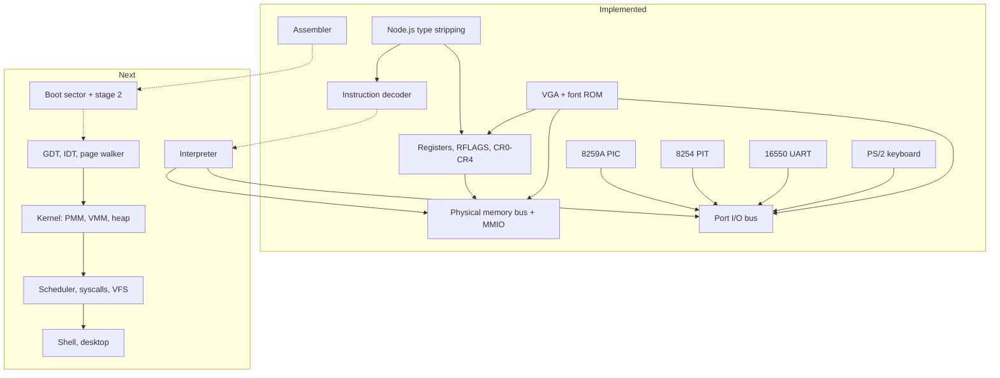

# VerixOS

An x86-64 operating system written in TypeScript, running on a faithful
instruction-level machine model. It boots as an ordinary Node process: no VM, no
QEMU, no disk image, no bootloader, and nothing that can touch your hardware.

```text
  V e r i x O S

  x86-64 machine model, TypeScript kernel substrate
  16 GP registers, RFLAGS, CR0-CR4, GDT/IDT, paging
  8259A PIC, 8254 PIT, 16550 UART, PS/2 keyboard, VGA

  x86-64 machine model, running on Node

  Status 253/253 tests passing   tsc --noEmit clean
  Boots on Node. Not on bare metal. See README.
```

<p align="center">
  
</p>

That image is not a mockup. It is rendered pixel-for-pixel by
`VgaAdapter.renderToRgb()` from the VGA text buffer at `0xB8000`, using the
project's own 8x16 CP437 glyph ROM. Regenerate it with `npm run screenshot`.

<p align="center">
  
</p>

The image above exercises the DAC and attribute path, including blink, so the
palette resolution is visible rather than assumed.

---

## Read this first: you cannot break your machine

This is the question everyone asks about an OS project, so the answer goes at
the top.

**VerixOS cannot damage your computer, and you do not need to reboot into it.**

| What you might worry about | Why it cannot happen |
| --- | --- |
| Writing to a physical disk | There is no disk driver and no raw-device access anywhere in the tree. The `src/` modules import nothing but each other and `node:zlib`/`node:fs` in one tooling script. |
| Installing drivers or kernel extensions | Not possible. There is no host-side driver loading at all, and VerixOS's "devices" are TypeScript classes running inside the Node process. |
| Overwriting your bootloader or partition table | Nothing ever writes outside the project directory. |
| Booting from a USB stick | There is no bootable image and no image builder yet. |
| Locking up your machine | The worst case is a Node process spinning its CPU. `Ctrl+C` always works. |

VerixOS is a **simulator**. It models a CPU, memory and devices as JavaScript
objects and interprets x86-64 machine code against them. It is closer to a
software implementation of hardware than to software that *drives* hardware.

To be precise about what that means: because the TypeScript kernel is executed
by the Node runtime rather than by a CPU, VerixOS does not boot on bare metal,
and it never will in its current form. See
[The native code boundary](#the-native-code-boundary) for what that does and does
not change, and [Limitations](#limitations) for the rest.

---

## Quick start

Requires **Node.js >= 22.6** and `git`. That is the entire dependency list —
there is no Rust toolchain, no native assembler, no emulator, and no Python.
The project has its own assembler, written in TypeScript, so nothing outside
Node needs to be installed.

```sh
git clone https://github.com/muraa-p/verixos
cd verixos
npm install
npm run typecheck
npm test
```

`npm run typecheck` is `tsc --noEmit` under a strict configuration and prints
nothing on success. `npm test` runs Node's built-in test runner.

## What works right now

This is the honest list. Anything not named here is either not started or not
finished, and the [status table](#status) below says which.

**The machine model exists and is tested.**

- Sixteen 64-bit general-purpose registers with correct 8/16/32/64-bit
  sub-register semantics, including the `AH`/`CH`/`DH`/`BH` versus
  `SPL`/`BPL`/`SIL`/`DIL` split that a REX prefix changes
- `RFLAGS` with architectural bit positions, the always-set bit 1, and the
  forced-zero bit 63
- CR0/CR2/CR3/CR4 with paging and protected-mode bits at their SDM positions
- A physical memory bus with strict bounds checking, MMIO regions, and register
  devices with correct sub-width merge semantics
- A separate port I/O bus that rejects overlapping device claims
- Device models: 8259A PIC (remapped to `0x20`/`0x28`), 8254 PIT (all six
  modes, read-back, latching), 16550 UART, PS/2 controller with scan code set 1,
  and a VGA adapter covering text mode, mode `0x12`, mode `0x0E`, Mode X planar
  graphics, mode `0x13`, and DAC palette programming

**The instruction decoder is real and substantially complete.**

It decodes prefixes, REX, ModRM and SIB across all three address widths, the
eight ALU operations in all six addressing forms, the shift and
rotate-through-carry groups, `MOVZX`/`MOVSX`, the seven string primitives at all
four widths, the full control-flow map including far pointers, `LOCK` and `REP`,
both the `0F 00` and `0F 01` system groups, `CPUID`, `RDTSC`/`RDTSCP`,
`XGETBV`/`XSETBV`, `LGDT`/`LIDT`/`LTR`/`LLDT`, and `UD2`. Undecodable
encodings raise a `DecodeError` rather than being quietly accepted.

**There is a real assembler, and it agrees with the decoder.**

`src/asm/` is a complete assembler: lexer, parser, two-pass label resolution, an
expression evaluator with full C precedence, iterative branch-width relaxation,
and an encoder covering all three CPU modes. The load-bearing property is not
that it assembles but that it agrees with the decoder. A round-trip oracle over
343 instructions and 1069 bytes across 17 groups asserts that every decoded line
re-assembles to the same bytes and re-decodes to the same text.

That oracle found sixteen real bugs, including the entire `0F 01` system group
being read from the wrong table in the SDM, `XGETBV` decoding as `LGDT`,
real-mode `push ax` assembling to `push eax`, and `pop cs` being encodable at
all. Every one produced plausible bytes, so none would have been caught by a test
that only checked the encoder against itself.

Here is real output from `VgaAdapter` and `InstructionDecoder` in this tree:

```text
$ node --experimental-strip-types -e '<decode a byte stream>'

  xor rax, rax                    ; 3 bytes @ 0x401000
  mov rbx, rax                    ; 3 bytes @ 0x401003
  mov rdi, 0x0                    ; 7 bytes @ 0x401006
  nop                             ; 4 bytes @ 0x40100d
  mov rax, [0x12345678]           ; 9 bytes @ 0x401011
  stos                            ; 2 bytes @ 0x40101a   (rep=rep)
  imul rax, rcx                   ; 4 bytes @ 0x40101c
  je 0x401030                     ; 6 bytes @ 0x401020
  je 0x40101a                     ; 2 bytes @ 0x401026
  sete rax                        ; 3 bytes @ 0x401028
```

<p align="center">
  
</p>

**Test suite:** 253 tests, all passing.

```text
$ npm test

TAP version 13
...
1..24
# tests 253
# suites 24
# pass 253
# fail 0
```

## What does not work yet

The kernel itself has not been written. There is no instruction interpreter, so
the decoder's output is not yet executed. There is no boot sector, no long-mode
transition, no page walker, no heap, no scheduler, no filesystem, no shell, and
no desktop.

The assembler does exist and is complete, which is worth separating from the
above: assembly source is assembled to real machine code today, and that code
decodes back to the same instructions. What is missing is anything that
*executes* it. `npm start` currently exits with a "module not found" for
`src/cli.ts` because that file does not exist yet.

This is version 0.1.0 of a project at roughly 20% of its first milestone. It is
a real foundation with a documented plan on top of it, not a finished operating
system, and it is better to say so here than to have you discover it after
cloning.

## Status

**Real** means implemented and covered by tests. **Partial** means the device or
model exists but the subsystem built on it does not. **Planned** means designed
and documented, not yet written.

| Subsystem | Status | Notes |
| --- | --- | --- |
| Architectural constants | Real | Normative, cited to the Intel SDM, shared by every layer |
| Register file and flags | Real | All sub-register widths, REX-aware byte registers |
| Physical memory bus | Real | Bounds-checked, MMIO regions, register devices |
| Port I/O bus | Real | Overlapping claims rejected at registration |
| Instruction decoder | Real | Prefix/ModRM/SIB, both `0F` system groups, far pointers, LOCK |
| 8259A PIC | Real | Dual-PIC pair with remapping and EOI |
| 8254 PIT | Real | All six modes, read-back command, counter latching |
| 16550 UART | Real | Interrupt and FIFO registers, divisor latch |
| PS/2 keyboard | Real | Scancode set 1, controller status, translate |
| VGA adapter | Real | Text, `0x12`, `0x0E`, Mode X, `0x13`, DAC, host rendering |
| Font ROM | Real | Hand-authored 8x8 CP437 glyphs, 8x16 derived |
| **Instruction interpreter** | Planned | Decoder output is not executed yet |
| **Assembler** | Real | Full x86-64 assembler; round-trip-checked against the decoder |
| **Boot sector and stage 2** | Planned | No long-mode transition exists |
| **GDT / IDT / segmentation** | Partial | Architectural constants exist; no tables built |
| **Paging and the page walker** | Partial | PTE layout and CR bits exist; no translation |
| **Physical memory manager** | Planned | Constants only |
| **Virtual memory manager** | Planned | Constants only |
| **Kernel heap** | Planned | Not started |
| **Interrupt dispatch** | Planned | Vectors defined; no gate handling |
| **Scheduler, tasks** | Planned | Not started |
| **Syscall ABI** | Partial | Numbers fixed; no entry path |
| **VFS and filesystem** | Planned | Not started |
| **Driver model** | Planned | Device models exist; the model above them does not |
| **Shell and desktop** | Planned | Not started |

## Repository layout

```text
verixos/
├── src/
│   ├── arch/        Architectural constants, register file, instruction decoder
│   ├── asm/         Assembler: lexer, parser, encoder, label resolution
│   ├── machine/     Memory bus, port I/O bus, device models
│   └── cli.ts       Entry point                    [not yet written]
├── tools/           Screenshot generator, bootable image builder
├── tests/           Node test-runner suites
├── docs/            ABI reference, roadmap, rendered assets
├── images/          Generated bootable images       [not committed]
└── dist/            Compiled output                [not committed]
```

## Architecture

The stack runs top-down: the host runtime executes the machine model, the machine
model executes real x86-64 code, and that code is the boot path into the kernel.



The solid edges exist today; the dashed ones are what the current milestone is
building. Full treatment in [ARCHITECTURE.md](ARCHITECTURE.md).

## The native code boundary

VerixOS has exactly one boundary between machine code and TypeScript kernel code.
It is called the native code registry, and it is deliberate and documented rather
than incidental.

Some kernel entry points will be written as x86-64 machine code and assembled by
the project's own TypeScript assembler. The rest of the kernel is TypeScript, and
it is entered through that single well-defined interface. A `call` executed by the
boot sector therefore lands in registry-managed code that dispatches onward into
TypeScript.

Two things follow, and both are worth stating plainly:

1. The TypeScript kernel is executed by the machine model's runtime. It is not
   machine code running on silicon.
2. A future native backend written in Rust or Zig would replace only the
   implementation behind the boundary. It would not change the subsystem design,
   the memory map, the ABI, or the driver model.

VerixOS is not QEMU-compatible and does not boot on bare metal. See
[ARCHITECTURE.md](ARCHITECTURE.md#the-native-code-boundary) for the mechanism and
[docs/roadmap.md](docs/roadmap.md) for the phase that introduces a native backend.

## Documentation

| Document | Contents |
| --- | --- |
| [ARCHITECTURE.md](ARCHITECTURE.md) | Design goals, layers, memory map, native code boundary, memory management, interrupt and scheduling models, VFS, syscall ABI, driver model, userland, boot sequence, trade-offs |
| [docs/abi.md](docs/abi.md) | Syscall numbers, calling convention, error convention, VFS node operations |
| [docs/roadmap.md](docs/roadmap.md) | Phased plan with acceptance criteria |
| [docs/testing.md](docs/testing.md) | How to test safely, what each suite covers, how to report a failure |
| [CONTRIBUTING.md](CONTRIBUTING.md) | Prerequisites, style rules, commit format, PR process, definition of done |
| [CHANGELOG.md](CHANGELOG.md) | Release history, Keep a Changelog format |
| [SECURITY.md](SECURITY.md) | Supported versions and how to report a vulnerability |
| [CODE_OF_CONDUCT.md](CODE_OF_CONDUCT.md) | Contributor Covenant 2.1 |

## Limitations

- **VerixOS does not boot on real hardware.** There is no bootable-sector-to-metal
  path. The kernel runs inside the machine model.
- **The TypeScript kernel is not native code.** It is executed by the simulator's
  runtime.
- **There is no interpreter yet.** The decoder produces instructions; nothing
  executes them. This is the single biggest gap.
- **The implemented instruction set is a subset.** The decoder and the encoder cover
  the classes the current milestones need, not the full x86-64 ISA. Anything
  undecodable raises `#UD` rather than being silently accepted, and anything not yet
  encoded is refused by the assembler with a message naming the missing encoding.
- **The assembler does not cover the whole ISA either.** Notably absent: `shld`/`shrd`,
  `pusha`/`popa`, x87, SSE/AVX, and the three-byte opcode maps. Where an instruction
  is missing the assembler says so rather than emitting a placeholder, so the gaps are
  refusals rather than silent wrong answers.
- **Interrupt architecture is legacy only.** One 8259A pair, one 8254 PIT. APIC
  and IOAPIC are described in the memory map but are not part of the interrupt
  path.
- **There is no SMP.** A single CPU is modelled.
- **There is no networking.** No network device, no stack, no socket layer.
- **Execution is deterministic.** Device interrupts are delivered at well-defined
  points in the instruction stream, so a given image and input sequence produces
  the same trace every run. Useful for testing; not a concurrent-programming
  testbed.
- **The project is pre-1.0.** No stability, security, or compatibility guarantees.
  See [SECURITY.md](SECURITY.md).

## Contributing

Bug reports from people who have actually run it are especially welcome — see
[docs/testing.md](docs/testing.md) for how. Please read
[CONTRIBUTING.md](CONTRIBUTING.md) first. Kernel changes require a corresponding
test. Participation is governed by the
[Code of Conduct](CODE_OF_CONDUCT.md).

## Licence

VerixOS is free software, licensed under the GNU General Public License, version
3 or (at your option) any later version. The full text is in
[LICENSE](LICENSE).

## Acknowledgements

- Intel, for the *Intel 64 and IA-32 Architectures Software Developer's Manual*,
  the normative reference for the machine model and the kernel's architectural
  behaviour. Sections are cited in the source.
- The contributors of the Linux kernel and of other teaching operating systems,
  for the shared body of practice around boot sequences, paging, interrupt
  dispatch and driver structure that any x86-64 kernel author inherits.
- The Node.js project, for native TypeScript type stripping, which is what makes
  a zero-build, zero-dependency TypeScript project practical.