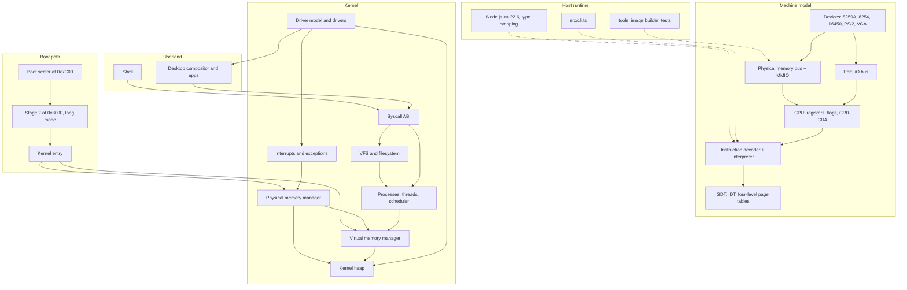

# VerixOS

VerixOS is a general-purpose operating system whose kernel is written in
TypeScript and which executes on a faithful x86-64 machine model implemented in
TypeScript. The machine model is not a mock: it carries real architectural
state — sixteen general-purpose registers plus RIP and RFLAGS with correct
8/16/32/64-bit sub-register semantics, CR0/CR2/CR3/CR4, a real GDT with
architectural descriptor encoding, an IDT of 16-byte gates, four-level page
tables, a physical memory bus with MMIO regions, a separate port I/O bus, and
device models for the 8259A PIC, the 8254 PIT, the 16450 UART, the PS/2
controller and VGA. It decodes and interprets real x86-64 machine code. On top
of that substrate the kernel is being built out as a set of genuine subsystems:
a bitmap frame allocator, a four-level virtual memory manager, a kernel heap,
GDT/IDT/segmentation, interrupt and exception dispatch, timer and serial and
keyboard and VGA drivers, a process and thread model with a preemptive
round-robin scheduler, a VFS over an in-memory filesystem, a syscall ABI and a
driver model, culminating in a shell and a graphical desktop.

**Where it actually is.** VerixOS is an early-stage project at version 0.1.0 and
the current milestone is a single vertical slice: boot, then paging, then heap,
then interrupts, then drivers, then scheduler, then VFS, then graphics, then a
shell, then a graphical desktop with applications. Several of those steps are
built; the rest are not yet. The status table below is the honest picture, and
[Limitations](#limitations-and-current-limitations) is deliberately unflattering.
Read both before drawing conclusions.

VerixOS does not boot on bare-metal hardware. The TypeScript kernel is executed
by the machine model's runtime; see
[The native code boundary](#the-native-code-boundary) for exactly what that
means and what a future native port would and would not change.

## Requirements

- Node.js >= 22.6 (the project relies on Node's native TypeScript type stripping)
- `git`, and nothing else

There is no Rust toolchain, no assembler, no emulator and no Python requirement.
VerixOS has zero runtime dependencies; TypeScript and `@types/node` are the only
devDependencies.

## Quick start

```sh
git clone https://github.com/verixos/verixos
cd verixos
npm install
npm run typecheck
npm test
npm start
```

`npm run typecheck` prints nothing on success — it is `tsc --noEmit` under the
project's strict configuration.

`npm test` runs the suite on Node's built-in test runner. The output is TAP:

```text
> node --experimental-strip-types --no-warnings --test tests/*.test.ts

TAP version 13
# Subtest: <name of a test>
ok 1 - <name of a test>
...
1..N
# pass N
# fail 0
```

The output above is illustrative and deliberately abbreviated; the number of
tests grows as the tree does. Run `npm test` for the real thing.

`npm start` boots the machine model and hands control to the kernel. If your
checkout exposes the CLI script as `run` rather than `start`, invoke it as
`npm run run`; the underlying command is the same either way.

The smoke flag is the same path CI uses:

```text
$ npm start -- boot --smoke
verixos 0.1.0  x86-64 machine model

  machine     128 MiB RAM, 40-bit physical address width
  memory      0x00000000-0x07ffffff RAM, 0 MiB MMIO claimed
  port io     0 ports claimed
  devices     (none)

  boot sector 512 bytes at 0x00007c00
  stage 2      16 sectors at 0x00008000 loaded via INT 13h
  long mode    CR0.PE=1 CR4.PAE=1 CR0.PG=1 CS.L=1
  identity map 0x00000000-0x3fffffff (1024 MiB)
  descriptors  gdt at 0x00080000, idt at 0x00081000
  kernel       entered through the native code registry
  smoke        ok
```

This sample output is illustrative. It shows the shape of a boot trace and the
naming of the stages, not a verified transcript; run it yourself for the real
output.

## Status

Status is reported per subsystem. **Real** means the subsystem is implemented
and exercised. **In progress** means it is partially built. **Planned** means it
is designed and documented but not yet implemented — mostly the tail of the
current milestone.

| Subsystem | Status | Notes |
| --- | --- | --- |
| Machine model | Real | Registers, RFLAGS, control registers, descriptors, buses |
| Instruction decode and interpretation | In progress | Real x86-64 decoding; the implemented subset is documented as a limitation |
| Physical memory manager | In progress | Bitmap frame allocator over 4 KiB frames |
| Virtual memory manager | In progress | Four-level paging, identity map, page fault handling |
| Kernel heap allocator | In progress | Backing the rest of the kernel |
| GDT / IDT / segmentation | In progress | Real descriptor encoding, 16-byte gates |
| Interrupt and exception dispatch | In progress | Exception vectors, gate dispatch, panic path |
| 8259A PIC | In progress | Legacy dual-PIC pair, remapping |
| 8254 PIT | In progress | Periodic timer, IRQ0 |
| 16450 UART | In progress | Serial console |
| PS/2 keyboard | In progress | Scancode translation |
| VGA text mode | In progress | Text console on the 0xB8000 window |
| VGA graphics mode | In progress | CRTC and sequencer modelled |
| Boot sector and stage 2 | In progress | 512-byte sector at 0x7C00, stage 2 at 0x8000 |
| Driver model | Planned | Registration, probe/bind, port and MMIO claims |
| Process and thread model | Planned | Addresses, kernel stacks, privilege levels |
| Preemptive scheduler | Planned | Round-robin on the PIT tick |
| System call ABI | Planned | Numbers fixed, entry path wired through the machine model |
| VFS | Planned | Node abstraction, operations table, path resolution |
| Filesystem | Planned | In-memory filesystem as the first backing store |
| Shell | Planned | Command dispatch in userland |
| Graphical desktop | Planned | Compositor, damage rectangles, applications |

## Repository layout

The tree below is the layout the subsystem split follows. `src/` is being
populated in dependency order; the subsystems listed here are the ones the
architecture documents describe.

```text
verixos/
├── src/
│   ├── arch/        Architectural constants and contracts: registers, flags,
│   │                control registers, descriptors, paging, vectors, syscalls.
│   │                Normative, and cited to the Intel SDM.
│   ├── machine/     The platform: physical memory bus, MMIO regions, port I/O
│   │                bus. The only place data moves between CPU and devices.
│   ├── cpu/         Instruction decode and the interpreter, exceptions,
│   │                privilege checks and the page walker.
│   ├── boot/        Boot sector and stage 2: the long-mode transition.
│   ├── kernel/      Kernel subsystems: PMM, VMM, heap, tasks, scheduler,
│   │                interrupts, VFS, syscall dispatch.
│   ├── devices/     Device models: 8259A, 8254, 16450, PS/2, VGA.
│   ├── drivers/     Drivers built on those models, and the driver model.
│   ├── user/        Userland: shell, desktop compositor, applications.
│   └── cli.ts       Entry point for the `verix` command.
├── tools/           Build-time tooling, including bootable image assembly.
├── tests/           Node test-runner suites, run with native type stripping.
├── docs/            ABI reference and roadmap.
├── images/          Generated bootable images (not committed).
└── dist/            Compiled output (not committed).
```

## Architecture

The stack runs top-down: the host runtime executes the machine model, the
machine model executes real x86-64 code, and that code is the boot path into the
kernel.



The full treatment, including memory maps, design rationale and trade-offs, is in
[ARCHITECTURE.md](ARCHITECTURE.md).

## The native code boundary

VerixOS has exactly one boundary between machine code and TypeScript kernel code.
It is called the native code registry, and it is deliberate and documented
rather than incidental.

Some kernel entry points are written as x86-64 machine code and assembled by
the project's own TypeScript assembler. The rest of the kernel is TypeScript, and
it is entered through that single well-defined interface. A `call` executed by
the boot sector therefore lands in registry-managed code that dispatches onward
into TypeScript.

Two things follow, and both are worth stating plainly:

1. The TypeScript kernel is executed by the machine model's runtime. It is not
   machine code running on silicon.
2. A future native backend written in Rust or Zig would replace only the
   implementation behind the boundary. It would not change the subsystem design,
   the memory map, the ABI, or the driver model.

VerixOS is not QEMU-compatible, and it does not boot on bare metal. See
[ARCHITECTURE.md](ARCHITECTURE.md#the-native-code-boundary) for the mechanism and
[docs/roadmap.md](docs/roadmap.md) for the phase that introduces the native
backend.

## Documentation

| Document | Contents |
| --- | --- |
| [ARCHITECTURE.md](ARCHITECTURE.md) | Design goals, layers, memory map, native code boundary, memory management, interrupt and scheduling models, VFS, syscall ABI, driver model, userland, boot sequence, trade-offs |
| [docs/abi.md](docs/abi.md) | Syscall numbers, calling convention, error convention, VFS node operations, and what userland may assume |
| [docs/roadmap.md](docs/roadmap.md) | Phased plan from the machine model through to SMP and networking, with acceptance criteria |
| [CONTRIBUTING.md](CONTRIBUTING.md) | Prerequisites, style rules, commit format, PR process, definition of done |
| [CHANGELOG.md](CHANGELOG.md) | Release history, Keep a Changelog format |
| [SECURITY.md](SECURITY.md) | Supported versions and how to report a vulnerability |
| [CODE_OF_CONDUCT.md](CODE_OF_CONDUCT.md) | Contributor Covenant 2.1 |

## Limitations and current limitations

This section is the one to read if you are deciding whether to depend on this
project. It is not exhaustive.

- **VerixOS does not boot on real hardware.** There is no bootable-sector-to-metal
  path. The kernel runs inside the machine model.
- **The TypeScript kernel is not native code.** It is executed by the simulator's
  runtime. Only a small, explicit set of entry points is x86-64 machine code.
- **The implemented instruction set is a subset.** The interpreter covers the
  instruction classes the current milestones need, not the full x86-64 ISA.
  Anything undecodable raises `#UD` rather than being silently accepted.
- **Interrupt architecture is legacy only.** There is one 8259A pair and one 8254
  PIT. APIC and IOAPIC are described in the memory map but are not yet part of the
  interrupt path.
- **There is no SMP.** A single CPU is modelled. No multiprocessor bring-up, no
  inter-processor interrupts, no per-CPU state.
- **There is no networking.** No network device, no stack, no socket layer.
- **Execution is deterministic and single-threaded in the execution model.**
  Device interrupts are delivered at well-defined points in the instruction
  stream, so a given image and input sequence produces the same trace every run.
  This is useful for testing and it does mean the simulator is not a
  general-purpose concurrent-programming testbed.
- **The project is pre-1.0.** It provides no stability guarantees, no security
  guarantees, and no compatibility guarantees. See
  [SECURITY.md](SECURITY.md).
- **Several subsystems are documented but not built.** See the status table above.

## Contributing

Contributions are welcome, and bug reports from people who have actually run it
are especially welcome. Please read [CONTRIBUTING.md](CONTRIBUTING.md) first: it
covers the development setup, the code style rules the tree depends on, the
commit format, and the definition of done. Kernel changes require a
corresponding test. Participation is governed by the
[Code of Conduct](CODE_OF_CONDUCT.md).

## Licence

VerixOS is free software, licensed under the GNU General Public License, version
3 or (at your option) any later version. The full text is in
[LICENSE](LICENSE).

```text
VerixOS is free software: you can redistribute it and/or modify it under the
terms of the GNU General Public License as published by the Free Software
Foundation, either version 3 of the License, or (at your option) any later
version.

VerixOS is distributed in the hope that it will be useful, but WITHOUT ANY
WARRANTY; without even the implied warranty of MERCHANTABILITY or FITNESS FOR A
PARTICULAR PURPOSE.  See the GNU General Public License for more details.

You should have received a copy of the GNU General Public License along with
VerixOS.  If not, see <https://www.gnu.org/licenses/>.
```

## Acknowledgements

VerixOS stands on a great deal of prior work, and the project is better for it:

- Intel, for the *Intel 64 and IA-32 Architectures Software Developer's Manual*,
  which is the normative reference for the machine model and the kernel's
  architectural behaviour. Sections are cited in the source.
- The contributors of the Linux kernel and of other teaching operating systems,
  for the shared body of practice around boot sequences, paging, interrupt
  dispatch and driver structure that any x86-64 kernel author inherits.
- The Node.js project, for native TypeScript type stripping, which is what makes
  a zero-build, zero-dependency TypeScript project practical.

Thank you to everyone who has reported a bug, read a design document and
disagreed with it, or contributed code.
